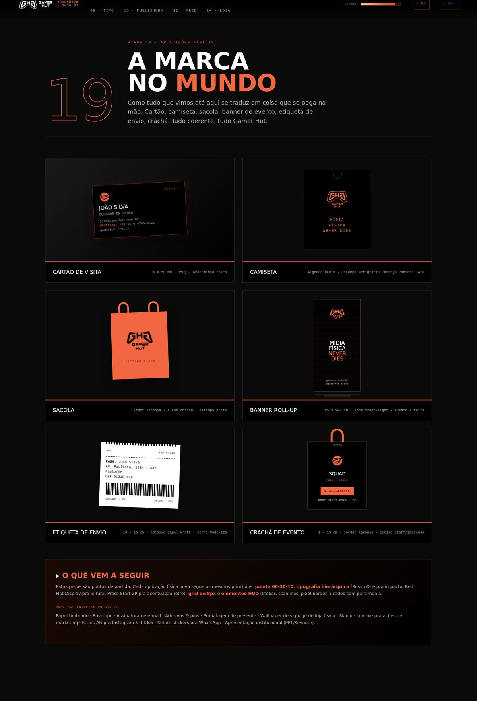

# GAMER HUT · Brandbook

> **Mídia Física Never Dies** — v.2026.07

Brandbook digital oficial da **GAMER HUT** — a casa de quem entende de games. Mídia física, original, lacrada.

Single-page HTML, sem build step, sem dependência de framework. Abre direto no navegador.



---

## 🔐 Acesso

O brandbook é protegido por senha (deterrent client-side, não é segurança real).

**Senha atual:** `GHUT2026`

Para trocar a senha, edite a constante `PASSWORD` no JavaScript dentro do `index.html` (busque por `// LOCK SCREEN`).

---

## 🔊 Áudio

O brandbook tem **sons 8-bit chiptune** sintetizados em tempo real (sem arquivos externos). Toca em momentos específicos:

| Momento | Som |
|---------|-----|
| Senha aceita | Fanfarra ascendente C5→C6 |
| Senha errada | Buzz grave |
| Click em link de navegação | Coin Mario clássico |
| Easter egg (Staff Roll) abrindo | Portal sweep 220→880Hz |
| Konami code completado | Fanfarra triunfal |
| Mudança de stage no scroll | Bleep sutil |
| Hover em CTAs | Blip curto |

**Toggles disponíveis na HUD** (canto superior direito):
- `♪ ON` / `♪ OFF` — sons de feedback
- `♫ BGM` — música ambiente loop chiptune (melodia original em A minor, lead + bass)

Preferências salvas em `localStorage`.

> Áudio só inicia após **primeira interação** (clique no PRESS START da senha) — limitação de autoplay policy dos browsers, não bug.

---

## 🎮 Como rodar localmente

```bash
git clone git@github.com:tgt/gamerhut-brandbook.git
cd gamerhut-brandbook

# Opção 1: Python (recomendado)
python3 -m http.server 8000

# Opção 2: Node
npx serve .

# Opção 3: PHP
php -S localhost:8000
```

Abrir no navegador: **http://localhost:8000**

> Para abrir direto sem servidor (`file://`), funciona — mas algumas fontes podem demorar a carregar e o `srcset` de imagens pode falhar em navegadores mais restritivos. Recomendado servir.

---

## 📦 Estrutura

```
gamerhut-brandbook/
├── index.html                    Single-page do brandbook (4019 linhas, 17 stages)
├── assets/
│   ├── logos/                    6 variações oficiais (SVG + PNG)
│   ├── games/                    Key art dos jogos (3 tamanhos cada)
│   └── tgt/                      Logo da agência (easter egg)
├── docs/
│   ├── CHANGELOG.md              Histórico de versões
│   ├── BRAND_GUIDELINES.md       Resumo das regras
│   └── screenshots/              Prints de cada stage
├── scripts/                      Automações
│   ├── optimize-images.sh
│   └── validate-html.sh
└── .github/                      Templates e workflows
```

---

## 🗺️ 22 Stages

| # | Stage | Conteúdo |
|---|-------|----------|
| 01 | Manifesto | Quem somos, por quê |
| 02 | Essência | Mídia Física Never Dies |
| 03 | Tom de Voz | Acessível, transparente, instigante |
| 04 | Pilares | 4 frentes da marca |
| 05 | Logo System | 6 variações oficiais |
| 06 | Usos do Logo | Faça · Não faça |
| 07 | **Grid &amp; Layout** ⭐ | 12 colunas · spacing scale · baseline 8px |
| 08 | Paleta | 6 cores · Regra 60-30-10 |
| 09 | Tipografia | 4 famílias · Hierarquia |
| 10 | **Iconografia** ⭐ | Sistema próprio · 18 ícones SVG |
| 11 | Grafismos | HUD · Scanlines · Pixels |
| 12 | **Patterns &amp; Texturas** ⭐ | 6 patterns repetíveis |
| 13 | Squad | 9 publishers parceiras |
| 14 | **Co-branding** ⭐ | Lockup com publishers |
| 15 | Voz em Ação | Casos de uso |
| 16 | Pilares de Conteúdo | Drop · Review · Tip · Lore · Resumo |
| 17 | Feed Instagram | Sistema modular 6 peças + grid 3×3 |
| 18 | Posts | Drop · Pré-venda · Story |
| 19 | **Aplicações Físicas** ⭐ | Cartão · Camiseta · Sacola · Banner · Etiqueta · Crachá |
| 20 | E-commerce | Mock loja online |
| 21 | Cheat Sheet | Copy pronto pra usar |
| 22 | Game Over | Créditos |

⭐ = novidades v2026.05

---

## 🎮 Easter eggs

Três caminhos pra desbloquear a tela secreta de **Staff Roll**:

| Trigger | Como |
|---------|------|
| **Konami Code** | `↑ ↑ ↓ ↓ ← → ← → B A` |
| **Atalho TGT** | Digite `T · G · T` no teclado |
| **Click 3×** | No badge laranja "▸ ESTE BRANDBOOK É VIVO" no rodapé |

Fecha com `ESC` ou no botão "▶ CONTINUE".

---

## 🚀 Deploy

Configurado para deploy automático via **Netlify** ou **GitHub Pages** (veja `.github/workflows/deploy.yml`).

**Preview de PRs:** todo Pull Request gera uma URL de preview automática (Netlify) — útil pra revisar mudanças antes do merge.

**Rollback:** cada release é tagueada (`v2026.MM`). Pra voltar a uma versão antiga, basta `git checkout vXXXX.XX`.

---

## 🤝 Contribuindo

1. Crie uma branch a partir da `main` atualizada:
   ```bash
   git checkout main && git pull
   git checkout -b feat/nome-da-feature
   ```
2. Commits no formato **Conventional Commits** (`feat:`, `fix:`, `content:`, `style:`, `docs:`, `chore:`).
3. Abra um PR com o template preenchido.
4. Ao menos 1 aprovação + checks verdes → merge.

Veja [CONTRIBUTING.md](docs/CONTRIBUTING.md) para detalhes.

---

## 🛠 Squad

- **Cliente:** GAMER HUT
- **Design + Estratégia + Code:** TGT Strategy MKT
- **Tagline:** *A Agência Além do Marketing*

---

## 📝 Versões

Veja o [CHANGELOG.md](docs/CHANGELOG.md) completo.

| Versão | Data | Destaques |
|--------|------|-----------|
| **v2026.07** | 2026-05-07 | Account/team revisions · copy &amp; voice refresh · paleta reorganizada |
| v2026.06 | 2026-05-07 | Logos reais nas aplicações físicas + fix mobile (iPhone) |
| v2026.05 | 2026-05-07 | 5 stages novos de identidade visual + BGM loop chiptune |
| v2026.04 | 2026-05-06 | Áudio 8-bit chiptune + toggle ON/OFF na HUD |
| v2026.03 | 2026-05-06 | Lock screen, TGT bombástico, fix logo HUD |
| v2026.02 | 2026-05-06 | Pilares de conteúdo, sistema modular, easter egg TGT |
| v2026.01 | 2026-01-06 | Versão inicial — 16 stages, feed Instagram, e-commerce |

---

## 📄 Licença

© 2026 GAMER HUT · Todos os direitos reservados.

Logos, marcas e key art de terceiros (Nintendo, Sony, Konami, Rockstar, etc.) são propriedade de seus respectivos publishers e usados aqui sob contexto editorial/educacional para fins de demonstração de identidade visual.
